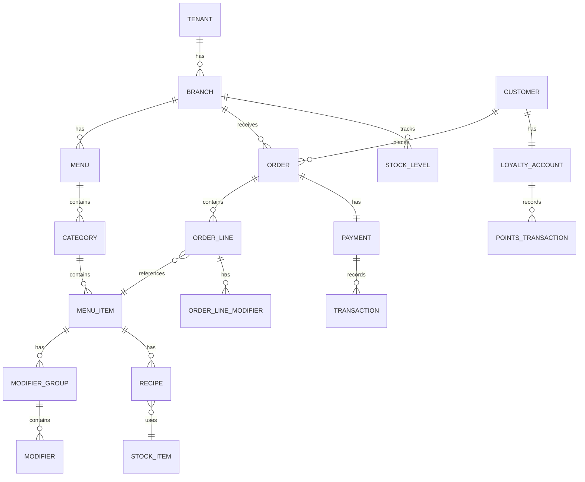

# Database Schema - Enterprise Restaurant Platform

> [!NOTE]
> This schema uses PostgreSQL 17+ features including LISTEN/NOTIFY, pg_cron, full-text search, and Row-Level Security for multi-tenancy.

---

## Schema Overview



---

## 1. Multi-Tenancy Foundation

```sql
-- ============================================================
-- MULTI-TENANCY & ORGANIZATION
-- ============================================================

-- Tenant: Top-level organization (restaurant chain/brand)
CREATE TABLE tenants (
    id              UUID PRIMARY KEY DEFAULT gen_random_uuid(),
    name            TEXT NOT NULL,
    slug            TEXT NOT NULL UNIQUE,
    settings        JSONB NOT NULL DEFAULT '{}',
    status          TEXT NOT NULL DEFAULT 'active'
                    CHECK (status IN ('active', 'suspended', 'trial')),
    created_at      TIMESTAMPTZ NOT NULL DEFAULT now(),
    updated_at      TIMESTAMPTZ NOT NULL DEFAULT now()
);

-- Branch: Physical or virtual location
CREATE TABLE branches (
    id              UUID PRIMARY KEY DEFAULT gen_random_uuid(),
    tenant_id       UUID NOT NULL REFERENCES tenants(id),
    name            TEXT NOT NULL,
    name_ar         TEXT,
    code            TEXT NOT NULL,

    -- Location
    address         JSONB,  -- {street, city, country, lat, lng}
    timezone        TEXT NOT NULL DEFAULT 'Africa/Cairo',

    -- Operations
    operating_hours JSONB,  -- {mon: {open: "09:00", close: "23:00"}, ...}
    order_types     TEXT[] NOT NULL DEFAULT ARRAY['dine_in', 'takeaway', 'delivery'],
    status          TEXT NOT NULL DEFAULT 'active',

    -- Settings (inherits from tenant, can override)
    settings        JSONB NOT NULL DEFAULT '{}',

    created_at      TIMESTAMPTZ NOT NULL DEFAULT now(),
    updated_at      TIMESTAMPTZ NOT NULL DEFAULT now(),

    UNIQUE (tenant_id, code)
);

CREATE INDEX idx_branches_tenant ON branches(tenant_id);
```

---

## 2. Catalog Context

```sql
-- ============================================================
-- CATALOG: MENUS, CATEGORIES, ITEMS
-- ============================================================

-- Menu: Container for categories (branch can have multiple menus)
CREATE TABLE menus (
    id              UUID PRIMARY KEY DEFAULT gen_random_uuid(),
    tenant_id       UUID NOT NULL REFERENCES tenants(id),
    branch_id       UUID REFERENCES branches(id),  -- NULL = all branches

    name            TEXT NOT NULL,
    name_ar         TEXT,
    type            TEXT NOT NULL DEFAULT 'standard'
                    CHECK (type IN ('standard', 'delivery', 'dine_in', 'qr', 'catering')),

    -- Availability
    is_active       BOOLEAN NOT NULL DEFAULT true,
    available_from  TIME,
    available_until TIME,
    available_days  INT[],  -- 0=Sun, 1=Mon, etc.

    sort_order      INT NOT NULL DEFAULT 0,
    created_at      TIMESTAMPTZ NOT NULL DEFAULT now(),
    updated_at      TIMESTAMPTZ NOT NULL DEFAULT now()
);

CREATE INDEX idx_menus_tenant ON menus(tenant_id);
CREATE INDEX idx_menus_branch ON menus(branch_id) WHERE branch_id IS NOT NULL;

-- Category: Grouping for menu items
CREATE TABLE categories (
    id              UUID PRIMARY KEY DEFAULT gen_random_uuid(),
    tenant_id       UUID NOT NULL REFERENCES tenants(id),
    menu_id         UUID NOT NULL REFERENCES menus(id) ON DELETE CASCADE,
    parent_id       UUID REFERENCES categories(id),  -- For subcategories

    name            TEXT NOT NULL,
    name_ar         TEXT,
    description     TEXT,
    description_ar  TEXT,
    image_url       TEXT,

    is_active       BOOLEAN NOT NULL DEFAULT true,
    sort_order      INT NOT NULL DEFAULT 0,

    created_at      TIMESTAMPTZ NOT NULL DEFAULT now(),
    updated_at      TIMESTAMPTZ NOT NULL DEFAULT now()
);

CREATE INDEX idx_categories_menu ON categories(menu_id);
CREATE INDEX idx_categories_parent ON categories(parent_id) WHERE parent_id IS NOT NULL;

-- Menu Item: Individual product
CREATE TABLE menu_items (
    id              UUID PRIMARY KEY DEFAULT gen_random_uuid(),
    tenant_id       UUID NOT NULL REFERENCES tenants(id),
    category_id     UUID NOT NULL REFERENCES categories(id) ON DELETE CASCADE,

    -- Basic Info
    sku             TEXT,
    name            TEXT NOT NULL,
    name_ar         TEXT,
    description     TEXT,
    description_ar  TEXT,
    image_url       TEXT,

    -- Pricing
    base_price      DECIMAL(10,2) NOT NULL,
    compare_price   DECIMAL(10,2),  -- Original price for discounts
    cost_price      DECIMAL(10,2),  -- For margin calculation

    -- Variants (if applicable)
    has_variants    BOOLEAN NOT NULL DEFAULT false,

    -- Attributes
    attributes      JSONB NOT NULL DEFAULT '{}',
    -- {
    --   "calories": 450,
    --   "allergens": ["gluten", "dairy"],
    --   "dietary": ["halal"],
    --   "prep_time_minutes": 15
    -- }

    -- Availability
    is_active       BOOLEAN NOT NULL DEFAULT true,
    is_available    BOOLEAN NOT NULL DEFAULT true,  -- Runtime stock status
    available_from  TIME,
    available_until TIME,

    -- Ordering
    min_qty         INT NOT NULL DEFAULT 1,
    max_qty         INT,
    sort_order      INT NOT NULL DEFAULT 0,

    -- Full-text search vector (auto-generated)
    search_vector   tsvector GENERATED ALWAYS AS (
        setweight(to_tsvector('english', coalesce(name, '')), 'A') ||
        setweight(to_tsvector('english', coalesce(description, '')), 'B') ||
        setweight(to_tsvector('simple', coalesce(name_ar, '')), 'A')
    ) STORED,

    created_at      TIMESTAMPTZ NOT NULL DEFAULT now(),
    updated_at      TIMESTAMPTZ NOT NULL DEFAULT now()
);

CREATE INDEX idx_menu_items_category ON menu_items(category_id);
CREATE INDEX idx_menu_items_tenant ON menu_items(tenant_id);
CREATE INDEX idx_menu_items_sku ON menu_items(tenant_id, sku) WHERE sku IS NOT NULL;
CREATE INDEX idx_menu_items_search ON menu_items USING GIN(search_vector);
CREATE INDEX idx_menu_items_active ON menu_items(category_id) WHERE is_active AND is_available;

-- Menu Item Variants (e.g., sizes)
CREATE TABLE menu_item_variants (
    id              UUID PRIMARY KEY DEFAULT gen_random_uuid(),
    item_id         UUID NOT NULL REFERENCES menu_items(id) ON DELETE CASCADE,

    name            TEXT NOT NULL,  -- e.g., "Small", "Medium", "Large"
    name_ar         TEXT,
    sku             TEXT,

    price           DECIMAL(10,2) NOT NULL,
    cost_price      DECIMAL(10,2),

    is_default      BOOLEAN NOT NULL DEFAULT false,
    is_active       BOOLEAN NOT NULL DEFAULT true,
    sort_order      INT NOT NULL DEFAULT 0,

    created_at      TIMESTAMPTZ NOT NULL DEFAULT now()
);

CREATE INDEX idx_variants_item ON menu_item_variants(item_id);

-- Modifier Groups (e.g., "Choose your sauce", "Add extras")
CREATE TABLE modifier_groups (
    id              UUID PRIMARY KEY DEFAULT gen_random_uuid(),
    tenant_id       UUID NOT NULL REFERENCES tenants(id),

    name            TEXT NOT NULL,
    name_ar         TEXT,

    -- Selection rules
    selection_type  TEXT NOT NULL DEFAULT 'single'
                    CHECK (selection_type IN ('single', 'multiple')),
    min_selections  INT NOT NULL DEFAULT 0,
    max_selections  INT,

    is_required     BOOLEAN NOT NULL DEFAULT false,

    created_at      TIMESTAMPTZ NOT NULL DEFAULT now(),
    updated_at      TIMESTAMPTZ NOT NULL DEFAULT now()
);

-- Link items to modifier groups
CREATE TABLE menu_item_modifier_groups (
    item_id         UUID NOT NULL REFERENCES menu_items(id) ON DELETE CASCADE,
    group_id        UUID NOT NULL REFERENCES modifier_groups(id) ON DELETE CASCADE,
    sort_order      INT NOT NULL DEFAULT 0,

    PRIMARY KEY (item_id, group_id)
);

-- Individual modifiers
CREATE TABLE modifiers (
    id              UUID PRIMARY KEY DEFAULT gen_random_uuid(),
    group_id        UUID NOT NULL REFERENCES modifier_groups(id) ON DELETE CASCADE,

    name            TEXT NOT NULL,
    name_ar         TEXT,

    price           DECIMAL(10,2) NOT NULL DEFAULT 0,
    cost_price      DECIMAL(10,2),

    is_default      BOOLEAN NOT NULL DEFAULT false,
    is_active       BOOLEAN NOT NULL DEFAULT true,
    sort_order      INT NOT NULL DEFAULT 0,

    created_at      TIMESTAMPTZ NOT NULL DEFAULT now()
);

CREATE INDEX idx_modifiers_group ON modifiers(group_id);
```

---

## 3. Ordering Context

```sql
-- ============================================================
-- ORDERING: CARTS, ORDERS, LINE ITEMS
-- ============================================================

-- Cart: Temporary order before checkout
CREATE TABLE carts (
    id              UUID PRIMARY KEY DEFAULT gen_random_uuid(),
    tenant_id       UUID NOT NULL REFERENCES tenants(id),
    branch_id       UUID NOT NULL REFERENCES branches(id),
    customer_id     UUID REFERENCES customers(id),

    -- Anonymous identification
    session_id      TEXT,
    device_id       TEXT,

    -- Context
    order_type      TEXT NOT NULL CHECK (order_type IN ('dine_in', 'takeaway', 'delivery')),
    table_id        UUID REFERENCES tables(id),

    -- Pricing snapshot
    subtotal        DECIMAL(10,2) NOT NULL DEFAULT 0,
    discount_amount DECIMAL(10,2) NOT NULL DEFAULT 0,
    tax_amount      DECIMAL(10,2) NOT NULL DEFAULT 0,
    total           DECIMAL(10,2) NOT NULL DEFAULT 0,

    -- Applied promotions
    applied_coupon  TEXT,
    applied_voucher UUID,

    expires_at      TIMESTAMPTZ NOT NULL DEFAULT (now() + interval '2 hours'),
    created_at      TIMESTAMPTZ NOT NULL DEFAULT now(),
    updated_at      TIMESTAMPTZ NOT NULL DEFAULT now()
);

CREATE INDEX idx_carts_session ON carts(session_id) WHERE session_id IS NOT NULL;
CREATE INDEX idx_carts_customer ON carts(customer_id) WHERE customer_id IS NOT NULL;
CREATE INDEX idx_carts_expires ON carts(expires_at);

-- Cart Lines
CREATE TABLE cart_lines (
    id              UUID PRIMARY KEY DEFAULT gen_random_uuid(),
    cart_id         UUID NOT NULL REFERENCES carts(id) ON DELETE CASCADE,

    item_id         UUID NOT NULL REFERENCES menu_items(id),
    variant_id      UUID REFERENCES menu_item_variants(id),

    quantity        INT NOT NULL DEFAULT 1,
    unit_price      DECIMAL(10,2) NOT NULL,
    line_total      DECIMAL(10,2) NOT NULL,

    notes           TEXT,

    created_at      TIMESTAMPTZ NOT NULL DEFAULT now()
);

CREATE INDEX idx_cart_lines_cart ON cart_lines(cart_id);

-- Cart Line Modifiers
CREATE TABLE cart_line_modifiers (
    id              UUID PRIMARY KEY DEFAULT gen_random_uuid(),
    cart_line_id    UUID NOT NULL REFERENCES cart_lines(id) ON DELETE CASCADE,
    modifier_id     UUID NOT NULL REFERENCES modifiers(id),

    quantity        INT NOT NULL DEFAULT 1,
    unit_price      DECIMAL(10,2) NOT NULL,
    line_total      DECIMAL(10,2) NOT NULL
);

CREATE INDEX idx_cart_line_modifiers ON cart_line_modifiers(cart_line_id);

-- Orders: Finalized orders
CREATE TABLE orders (
    id              UUID PRIMARY KEY DEFAULT gen_random_uuid(),
    tenant_id       UUID NOT NULL REFERENCES tenants(id),
    branch_id       UUID NOT NULL REFERENCES branches(id),
    customer_id     UUID REFERENCES customers(id),

    -- Identifiers
    order_number    TEXT NOT NULL,  -- Human-readable: "A-001", "B-042"
    daily_number    INT NOT NULL,   -- Resets daily per branch

    -- Type & Status
    order_type      TEXT NOT NULL CHECK (order_type IN ('dine_in', 'takeaway', 'delivery')),
    status          TEXT NOT NULL DEFAULT 'pending' CHECK (status IN (
        'pending',      -- Awaiting confirmation
        'confirmed',    -- Accepted by kitchen
        'preparing',    -- In kitchen
        'ready',        -- Ready for pickup/serve
        'out_for_delivery',
        'completed',    -- Delivered/served
        'cancelled'
    )),

    -- Context
    table_id        UUID REFERENCES tables(id),
    source          TEXT NOT NULL DEFAULT 'website'
                    CHECK (source IN ('website', 'qr', 'pos', 'phone', 'aggregator')),

    -- Delivery info
    delivery_address JSONB,
    delivery_notes   TEXT,
    scheduled_at     TIMESTAMPTZ,  -- For pre-orders

    -- Pricing
    subtotal        DECIMAL(10,2) NOT NULL,
    discount_amount DECIMAL(10,2) NOT NULL DEFAULT 0,
    tax_amount      DECIMAL(10,2) NOT NULL DEFAULT 0,
    delivery_fee    DECIMAL(10,2) NOT NULL DEFAULT 0,
    service_fee     DECIMAL(10,2) NOT NULL DEFAULT 0,
    tip_amount      DECIMAL(10,2) NOT NULL DEFAULT 0,
    total           DECIMAL(10,2) NOT NULL,

    -- Payment
    payment_method  TEXT,
    payment_status  TEXT NOT NULL DEFAULT 'pending'
                    CHECK (payment_status IN ('pending', 'paid', 'partial', 'refunded', 'failed')),

    -- Promotions
    coupon_code     TEXT,
    voucher_id      UUID,
    points_redeemed INT DEFAULT 0,
    points_value    DECIMAL(10,2) DEFAULT 0,

    -- Timestamps
    confirmed_at    TIMESTAMPTZ,
    preparing_at    TIMESTAMPTZ,
    ready_at        TIMESTAMPTZ,
    completed_at    TIMESTAMPTZ,
    cancelled_at    TIMESTAMPTZ,
    cancelled_reason TEXT,

    created_at      TIMESTAMPTZ NOT NULL DEFAULT now(),
    updated_at      TIMESTAMPTZ NOT NULL DEFAULT now()
);

-- Unique order number per branch per day
CREATE UNIQUE INDEX idx_orders_number ON orders(branch_id, order_number);
CREATE INDEX idx_orders_tenant ON orders(tenant_id);
CREATE INDEX idx_orders_branch_status ON orders(branch_id, status);
CREATE INDEX idx_orders_customer ON orders(customer_id) WHERE customer_id IS NOT NULL;
CREATE INDEX idx_orders_created ON orders(branch_id, created_at DESC);

-- Order Lines
CREATE TABLE order_lines (
    id              UUID PRIMARY KEY DEFAULT gen_random_uuid(),
    order_id        UUID NOT NULL REFERENCES orders(id) ON DELETE CASCADE,

    -- Snapshot of item at time of order
    item_id         UUID NOT NULL REFERENCES menu_items(id),
    variant_id      UUID REFERENCES menu_item_variants(id),
    item_snapshot   JSONB NOT NULL,  -- {name, name_ar, sku, variant_name}

    quantity        INT NOT NULL DEFAULT 1,
    unit_price      DECIMAL(10,2) NOT NULL,
    line_total      DECIMAL(10,2) NOT NULL,

    notes           TEXT,

    -- Kitchen status (per-item tracking)
    kitchen_status  TEXT DEFAULT 'pending'
                    CHECK (kitchen_status IN ('pending', 'preparing', 'ready', 'served')),

    created_at      TIMESTAMPTZ NOT NULL DEFAULT now()
);

CREATE INDEX idx_order_lines_order ON order_lines(order_id);

-- Order Line Modifiers
CREATE TABLE order_line_modifiers (
    id              UUID PRIMARY KEY DEFAULT gen_random_uuid(),
    order_line_id   UUID NOT NULL REFERENCES order_lines(id) ON DELETE CASCADE,

    modifier_id     UUID NOT NULL REFERENCES modifiers(id),
    modifier_snapshot JSONB NOT NULL,  -- {name, name_ar, group_name}

    quantity        INT NOT NULL DEFAULT 1,
    unit_price      DECIMAL(10,2) NOT NULL,
    line_total      DECIMAL(10,2) NOT NULL
);

CREATE INDEX idx_order_line_modifiers ON order_line_modifiers(order_line_id);

-- Order status change notification trigger
-- Emits events for SSE broadcasting
CREATE OR REPLACE FUNCTION notify_order_change()
RETURNS TRIGGER AS $$
BEGIN
    PERFORM pg_notify(
        'order_events',
        json_build_object(
            'event', CASE
                WHEN TG_OP = 'INSERT' THEN 'order_created'
                WHEN NEW.status != OLD.status THEN 'order_status_changed'
                ELSE 'order_updated'
            END,
            'order_id', NEW.id,
            'order_number', NEW.order_number,
            'status', NEW.status,
            'branch_id', NEW.branch_id,
            'tenant_id', NEW.tenant_id,
            'timestamp', extract(epoch from now())
        )::text
    );
    RETURN NEW;
END;
$$ LANGUAGE plpgsql;

CREATE TRIGGER order_notify_trigger
    AFTER INSERT OR UPDATE ON orders
    FOR EACH ROW EXECUTE FUNCTION notify_order_change();
```

---

## 4. Customer & CRM Context

```sql
-- ============================================================
-- CRM: CUSTOMERS, LOYALTY, COMMUNICATIONS
-- ============================================================

-- Customers
CREATE TABLE customers (
    id              UUID PRIMARY KEY DEFAULT gen_random_uuid(),
    tenant_id       UUID NOT NULL REFERENCES tenants(id),

    -- Authentication
    phone           TEXT,
    email           TEXT,
    password_hash   TEXT,

    -- Profile
    first_name      TEXT,
    last_name       TEXT,
    display_name    TEXT,
    avatar_url      TEXT,

    -- Preferences
    language        TEXT DEFAULT 'en',
    birthday        DATE,
    preferences     JSONB DEFAULT '{}',  -- {dietary: [], allergies: [], favorites: []}

    -- Status
    is_verified     BOOLEAN NOT NULL DEFAULT false,
    is_active       BOOLEAN NOT NULL DEFAULT true,

    -- Analytics
    first_order_at  TIMESTAMPTZ,
    last_order_at   TIMESTAMPTZ,
    total_orders    INT NOT NULL DEFAULT 0,
    total_spent     DECIMAL(12,2) NOT NULL DEFAULT 0,

    -- Segmentation
    tags            TEXT[] DEFAULT '{}',
    segment         TEXT,  -- 'new', 'returning', 'vip', 'at_risk', 'churned'

    created_at      TIMESTAMPTZ NOT NULL DEFAULT now(),
    updated_at      TIMESTAMPTZ NOT NULL DEFAULT now()
);

CREATE UNIQUE INDEX idx_customers_phone ON customers(tenant_id, phone) WHERE phone IS NOT NULL;
CREATE UNIQUE INDEX idx_customers_email ON customers(tenant_id, email) WHERE email IS NOT NULL;
CREATE INDEX idx_customers_tenant ON customers(tenant_id);
CREATE INDEX idx_customers_segment ON customers(tenant_id, segment);

-- Customer Addresses
CREATE TABLE customer_addresses (
    id              UUID PRIMARY KEY DEFAULT gen_random_uuid(),
    customer_id     UUID NOT NULL REFERENCES customers(id) ON DELETE CASCADE,

    label           TEXT,  -- "Home", "Work"
    street          TEXT NOT NULL,
    building        TEXT,
    floor           TEXT,
    apartment       TEXT,
    city            TEXT NOT NULL,
    area            TEXT,

    lat             DECIMAL(10,7),
    lng             DECIMAL(10,7),

    is_default      BOOLEAN NOT NULL DEFAULT false,

    created_at      TIMESTAMPTZ NOT NULL DEFAULT now()
);

CREATE INDEX idx_addresses_customer ON customer_addresses(customer_id);

-- Loyalty Account
CREATE TABLE loyalty_accounts (
    id              UUID PRIMARY KEY DEFAULT gen_random_uuid(),
    customer_id     UUID NOT NULL REFERENCES customers(id) ON DELETE CASCADE UNIQUE,
    tenant_id       UUID NOT NULL REFERENCES tenants(id),

    points_balance  INT NOT NULL DEFAULT 0,
    lifetime_points INT NOT NULL DEFAULT 0,
    tier            TEXT DEFAULT 'bronze' CHECK (tier IN ('bronze', 'silver', 'gold', 'platinum')),
    tier_expires_at TIMESTAMPTZ,

    created_at      TIMESTAMPTZ NOT NULL DEFAULT now(),
    updated_at      TIMESTAMPTZ NOT NULL DEFAULT now()
);

CREATE INDEX idx_loyalty_customer ON loyalty_accounts(customer_id);
CREATE INDEX idx_loyalty_tenant ON loyalty_accounts(tenant_id);

-- Points Transactions
CREATE TABLE points_transactions (
    id              UUID PRIMARY KEY DEFAULT gen_random_uuid(),
    loyalty_id      UUID NOT NULL REFERENCES loyalty_accounts(id),

    type            TEXT NOT NULL CHECK (type IN ('earn', 'redeem', 'expire', 'adjust', 'bonus')),
    points          INT NOT NULL,  -- Positive for earn, negative for redeem
    balance_after   INT NOT NULL,

    -- Reference
    order_id        UUID REFERENCES orders(id),
    reason          TEXT,

    expires_at      TIMESTAMPTZ,  -- For earned points

    created_at      TIMESTAMPTZ NOT NULL DEFAULT now()
);

CREATE INDEX idx_points_loyalty ON points_transactions(loyalty_id);
CREATE INDEX idx_points_order ON points_transactions(order_id) WHERE order_id IS NOT NULL;
```

---

## 5. Payments Context

```sql
-- ============================================================
-- PAYMENTS: TRANSACTIONS, LEDGER
-- ============================================================

-- Payments (per order)
CREATE TABLE payments (
    id              UUID PRIMARY KEY DEFAULT gen_random_uuid(),
    tenant_id       UUID NOT NULL REFERENCES tenants(id),
    order_id        UUID NOT NULL REFERENCES orders(id),

    amount          DECIMAL(10,2) NOT NULL,
    currency        TEXT NOT NULL DEFAULT 'EGP',

    method          TEXT NOT NULL CHECK (method IN (
        'cash', 'card', 'wallet', 'online', 'points'
    )),
    provider        TEXT,  -- 'stripe', 'paymob', 'vf_cash'

    status          TEXT NOT NULL DEFAULT 'pending' CHECK (status IN (
        'pending', 'processing', 'succeeded', 'failed', 'refunded', 'partial_refund'
    )),

    -- Provider reference
    external_id     TEXT,  -- Payment gateway transaction ID

    -- Card details (masked)
    card_brand      TEXT,
    card_last4      TEXT,

    -- Metadata
    metadata        JSONB DEFAULT '{}',

    paid_at         TIMESTAMPTZ,
    created_at      TIMESTAMPTZ NOT NULL DEFAULT now(),
    updated_at      TIMESTAMPTZ NOT NULL DEFAULT now()
);

CREATE INDEX idx_payments_order ON payments(order_id);
CREATE INDEX idx_payments_tenant ON payments(tenant_id);
CREATE INDEX idx_payments_external ON payments(external_id) WHERE external_id IS NOT NULL;

-- Transactions (immutable ledger)
CREATE TABLE transactions (
    id              UUID PRIMARY KEY DEFAULT gen_random_uuid(),
    tenant_id       UUID NOT NULL REFERENCES tenants(id),
    payment_id      UUID REFERENCES payments(id),

    type            TEXT NOT NULL CHECK (type IN (
        'charge', 'refund', 'payout', 'adjustment', 'fee'
    )),

    amount          DECIMAL(10,2) NOT NULL,  -- Always positive
    direction       TEXT NOT NULL CHECK (direction IN ('credit', 'debit')),

    description     TEXT,
    reference       TEXT,

    created_at      TIMESTAMPTZ NOT NULL DEFAULT now()
);

-- Immutable: no updates allowed
CREATE INDEX idx_transactions_payment ON transactions(payment_id);
CREATE INDEX idx_transactions_tenant ON transactions(tenant_id);
CREATE INDEX idx_transactions_created ON transactions(tenant_id, created_at DESC);
```

---

## 6. Inventory Context

```sql
-- ============================================================
-- INVENTORY: STOCK, BOM, TRACKING
-- ============================================================

-- Stock Items (ingredients)
CREATE TABLE stock_items (
    id              UUID PRIMARY KEY DEFAULT gen_random_uuid(),
    tenant_id       UUID NOT NULL REFERENCES tenants(id),

    sku             TEXT NOT NULL,
    name            TEXT NOT NULL,
    name_ar         TEXT,

    unit            TEXT NOT NULL,  -- 'kg', 'g', 'l', 'ml', 'piece'
    category        TEXT,

    -- Thresholds
    reorder_level   DECIMAL(10,3),
    reorder_qty     DECIMAL(10,3),

    cost_per_unit   DECIMAL(10,4),

    is_active       BOOLEAN NOT NULL DEFAULT true,

    created_at      TIMESTAMPTZ NOT NULL DEFAULT now(),
    updated_at      TIMESTAMPTZ NOT NULL DEFAULT now()
);

CREATE UNIQUE INDEX idx_stock_items_sku ON stock_items(tenant_id, sku);
CREATE INDEX idx_stock_items_tenant ON stock_items(tenant_id);

-- Stock Levels (per branch)
CREATE TABLE stock_levels (
    id              UUID PRIMARY KEY DEFAULT gen_random_uuid(),
    stock_item_id   UUID NOT NULL REFERENCES stock_items(id),
    branch_id       UUID NOT NULL REFERENCES branches(id),

    quantity        DECIMAL(10,3) NOT NULL DEFAULT 0,
    reserved        DECIMAL(10,3) NOT NULL DEFAULT 0,  -- Reserved by pending orders
    available       DECIMAL(10,3) GENERATED ALWAYS AS (quantity - reserved) STORED,

    last_counted_at TIMESTAMPTZ,

    updated_at      TIMESTAMPTZ NOT NULL DEFAULT now(),

    UNIQUE (stock_item_id, branch_id)
);

CREATE INDEX idx_stock_levels_branch ON stock_levels(branch_id);
CREATE INDEX idx_stock_levels_low ON stock_levels(stock_item_id)
    WHERE available < 0;  -- Negative = oversold

-- Recipes (Bill of Materials)
CREATE TABLE recipes (
    id              UUID PRIMARY KEY DEFAULT gen_random_uuid(),
    item_id         UUID NOT NULL REFERENCES menu_items(id) ON DELETE CASCADE,
    variant_id      UUID REFERENCES menu_item_variants(id),

    stock_item_id   UUID NOT NULL REFERENCES stock_items(id),
    quantity        DECIMAL(10,4) NOT NULL,  -- Amount consumed per unit sold

    -- For modifiers that affect ingredients
    modifier_id     UUID REFERENCES modifiers(id),
    modifier_action TEXT CHECK (modifier_action IN ('add', 'remove', 'replace')),

    UNIQUE (item_id, variant_id, stock_item_id, modifier_id)
);

CREATE INDEX idx_recipes_item ON recipes(item_id);
CREATE INDEX idx_recipes_stock ON recipes(stock_item_id);

-- Stock Movements (audit trail)
CREATE TABLE stock_movements (
    id              UUID PRIMARY KEY DEFAULT gen_random_uuid(),
    stock_item_id   UUID NOT NULL REFERENCES stock_items(id),
    branch_id       UUID NOT NULL REFERENCES branches(id),

    type            TEXT NOT NULL CHECK (type IN (
        'purchase', 'sale', 'adjustment', 'waste', 'transfer_in', 'transfer_out', 'count'
    )),

    quantity        DECIMAL(10,3) NOT NULL,  -- Positive or negative
    balance_after   DECIMAL(10,3) NOT NULL,

    -- Reference
    order_id        UUID REFERENCES orders(id),
    reason          TEXT,

    created_by      UUID,
    created_at      TIMESTAMPTZ NOT NULL DEFAULT now()
);

CREATE INDEX idx_movements_stock ON stock_movements(stock_item_id, branch_id);
CREATE INDEX idx_movements_created ON stock_movements(branch_id, created_at DESC);
```

---

## 7. Table & Floor Management

```sql
-- ============================================================
-- FLOOR: TABLES, ROOMS, RESERVATIONS
-- ============================================================

-- Rooms/Areas
CREATE TABLE rooms (
    id              UUID PRIMARY KEY DEFAULT gen_random_uuid(),
    branch_id       UUID NOT NULL REFERENCES branches(id) ON DELETE CASCADE,

    name            TEXT NOT NULL,
    name_ar         TEXT,

    sort_order      INT NOT NULL DEFAULT 0,
    is_active       BOOLEAN NOT NULL DEFAULT true,

    created_at      TIMESTAMPTZ NOT NULL DEFAULT now()
);

CREATE INDEX idx_rooms_branch ON rooms(branch_id);

-- Tables
CREATE TABLE tables (
    id              UUID PRIMARY KEY DEFAULT gen_random_uuid(),
    branch_id       UUID NOT NULL REFERENCES branches(id) ON DELETE CASCADE,
    room_id         UUID REFERENCES rooms(id),

    number          TEXT NOT NULL,
    name            TEXT,

    capacity        INT NOT NULL DEFAULT 4,
    min_capacity    INT NOT NULL DEFAULT 1,

    -- Position (for visual layout)
    position_x      INT,
    position_y      INT,
    shape           TEXT DEFAULT 'square' CHECK (shape IN ('square', 'round', 'rectangle')),

    -- Status
    status          TEXT NOT NULL DEFAULT 'available'
                    CHECK (status IN ('available', 'occupied', 'reserved', 'blocked')),

    is_active       BOOLEAN NOT NULL DEFAULT true,

    created_at      TIMESTAMPTZ NOT NULL DEFAULT now(),
    updated_at      TIMESTAMPTZ NOT NULL DEFAULT now()
);

CREATE UNIQUE INDEX idx_tables_number ON tables(branch_id, number);
CREATE INDEX idx_tables_branch ON tables(branch_id);
CREATE INDEX idx_tables_room ON tables(room_id);

-- Reservations
CREATE TABLE reservations (
    id              UUID PRIMARY KEY DEFAULT gen_random_uuid(),
    tenant_id       UUID NOT NULL REFERENCES tenants(id),
    branch_id       UUID NOT NULL REFERENCES branches(id),
    table_id        UUID REFERENCES tables(id),
    customer_id     UUID REFERENCES customers(id),

    -- Guest info (may not be customer)
    guest_name      TEXT NOT NULL,
    guest_phone     TEXT NOT NULL,
    guest_email     TEXT,
    party_size      INT NOT NULL,

    -- Timing
    reserved_at     TIMESTAMPTZ NOT NULL,  -- Reservation time
    duration_mins   INT NOT NULL DEFAULT 90,

    -- Status
    status          TEXT NOT NULL DEFAULT 'pending' CHECK (status IN (
        'pending', 'confirmed', 'seated', 'completed', 'no_show', 'cancelled'
    )),

    -- Pre-order
    preorder_id     UUID REFERENCES orders(id),

    notes           TEXT,
    special_requests TEXT,

    confirmed_at    TIMESTAMPTZ,
    seated_at       TIMESTAMPTZ,
    completed_at    TIMESTAMPTZ,
    cancelled_at    TIMESTAMPTZ,

    created_at      TIMESTAMPTZ NOT NULL DEFAULT now(),
    updated_at      TIMESTAMPTZ NOT NULL DEFAULT now()
);

CREATE INDEX idx_reservations_branch ON reservations(branch_id);
CREATE INDEX idx_reservations_date ON reservations(branch_id, reserved_at);
CREATE INDEX idx_reservations_table ON reservations(table_id);
```

---

## 8. Task Queue & Background Jobs

```sql
-- ============================================================
-- INFRASTRUCTURE: TASK QUEUE, JOBS
-- ============================================================

-- Task Queue (PostgreSQL-based job queue)
CREATE TABLE task_queue (
    id              BIGSERIAL PRIMARY KEY,

    task_type       TEXT NOT NULL,
    payload         JSONB NOT NULL,

    -- Execution control
    status          TEXT NOT NULL DEFAULT 'pending'
                    CHECK (status IN ('pending', 'processing', 'done', 'failed', 'dead')),
    priority        INT NOT NULL DEFAULT 0,

    -- Retry logic
    attempts        INT NOT NULL DEFAULT 0,
    max_attempts    INT NOT NULL DEFAULT 3,
    last_error      TEXT,

    -- Scheduling
    run_at          TIMESTAMPTZ NOT NULL DEFAULT now(),
    started_at      TIMESTAMPTZ,
    completed_at    TIMESTAMPTZ,

    -- Locking
    locked_by       TEXT,
    locked_at       TIMESTAMPTZ,

    created_at      TIMESTAMPTZ NOT NULL DEFAULT now()
);

-- Index for worker polling
CREATE INDEX idx_task_queue_pending ON task_queue (run_at, priority DESC)
    WHERE status = 'pending';

-- Stale lock detection
CREATE INDEX idx_task_queue_stale ON task_queue (locked_at)
    WHERE status = 'processing' AND locked_at < now() - interval '5 minutes';

-- Task types:
-- 'send_sms', 'send_email', 'send_push', 'process_loyalty',
-- 'sync_inventory', 'generate_report', 'cleanup_carts'

-- Worker claims task (atomic)
-- Used in .NET: ExecuteScalarAsync with this query
/*
UPDATE task_queue
SET status = 'processing',
    locked_at = now(),
    locked_by = @worker_id,
    attempts = attempts + 1
WHERE id = (
    SELECT id FROM task_queue
    WHERE status = 'pending' AND run_at <= now()
    ORDER BY priority DESC, run_at ASC
    FOR UPDATE SKIP LOCKED
    LIMIT 1
)
RETURNING *;
*/
```

---

## 9. Cache Tables (UNLOGGED)

```sql
-- ============================================================
-- CACHE: UNLOGGED TABLES FOR HOT DATA
-- ============================================================

-- Menu cache (rebuilt on menu changes)
CREATE UNLOGGED TABLE menu_cache (
    branch_id       UUID PRIMARY KEY,
    menu_json       JSONB NOT NULL,

    -- Include category/item structure for fast retrieval
    categories      JSONB NOT NULL DEFAULT '[]',

    version         INT NOT NULL DEFAULT 1,
    expires_at      TIMESTAMPTZ NOT NULL,
    updated_at      TIMESTAMPTZ NOT NULL DEFAULT now()
);

-- Active orders cache (for KDS/POS)
CREATE UNLOGGED TABLE active_orders_cache (
    branch_id       UUID NOT NULL,
    order_id        UUID NOT NULL,
    order_data      JSONB NOT NULL,

    status          TEXT NOT NULL,
    updated_at      TIMESTAMPTZ NOT NULL DEFAULT now(),

    PRIMARY KEY (branch_id, order_id)
);

CREATE INDEX idx_active_orders_status ON active_orders_cache(branch_id, status);

-- Session store (for auth)
CREATE UNLOGGED TABLE sessions (
    id              TEXT PRIMARY KEY,
    user_id         UUID NOT NULL,
    user_type       TEXT NOT NULL,  -- 'customer', 'staff'
    tenant_id       UUID NOT NULL,

    data            JSONB NOT NULL DEFAULT '{}',

    expires_at      TIMESTAMPTZ NOT NULL,
    created_at      TIMESTAMPTZ NOT NULL DEFAULT now()
);

CREATE INDEX idx_sessions_user ON sessions(user_id);
CREATE INDEX idx_sessions_expires ON sessions(expires_at);
```

---

## 10. Row-Level Security (Multi-Tenancy)

```sql
-- ============================================================
-- SECURITY: ROW-LEVEL SECURITY POLICIES
-- ============================================================

-- Enable RLS on tenant-scoped tables
ALTER TABLE branches ENABLE ROW LEVEL SECURITY;
ALTER TABLE menus ENABLE ROW LEVEL SECURITY;
ALTER TABLE categories ENABLE ROW LEVEL SECURITY;
ALTER TABLE menu_items ENABLE ROW LEVEL SECURITY;
ALTER TABLE orders ENABLE ROW LEVEL SECURITY;
ALTER TABLE customers ENABLE ROW LEVEL SECURITY;

-- Create policies (using session variable)
CREATE POLICY tenant_isolation_branches ON branches
    USING (tenant_id = current_setting('app.tenant_id', true)::uuid);

CREATE POLICY tenant_isolation_menus ON menus
    USING (tenant_id = current_setting('app.tenant_id', true)::uuid);

CREATE POLICY tenant_isolation_orders ON orders
    USING (tenant_id = current_setting('app.tenant_id', true)::uuid);

-- Application sets tenant context per request:
-- SET LOCAL app.tenant_id = 'abc-123';

-- Bypass for admin/superuser
CREATE POLICY admin_bypass ON orders
    USING (current_setting('app.is_admin', true)::boolean = true);
```

---

## Next Steps

1. Review [Implementation Plan: Ordering Context](./implementation-plan-ordering.md)
2. [System Architecture](./system-architecture.md) for deployment details
