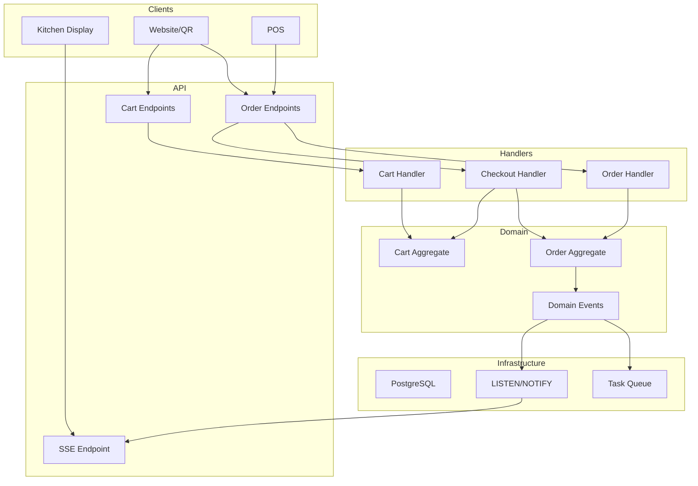

# Implementation Plan: Ordering Bounded Context

## Overview

The **Ordering** context is the transactional heart of the platform. It handles cart management, checkout, order lifecycle, and real-time updates to kitchen and customers.

> [!IMPORTANT]
> This is a **design document** for review. Implementation should proceed only after approval.

---

## Goals

1. **Cart Management** - Add/update/remove items, apply promotions
2. **Checkout Flow** - Validate, calculate totals, create order
3. **Order Lifecycle** - Status transitions, kitchen routing, notifications
4. **Real-Time Updates** - SSE for order status, queue position

---

## Architecture Overview



---

## Phase 1: Cart Management

### Proposed Changes

#### [NEW] `src/Domain/Ordering/Cart.cs`

Domain entity for cart aggregate with:

- `AddItem(itemId, variantId, quantity, modifiers)`
- `UpdateQuantity(lineId, quantity)`
- `RemoveItem(lineId)`
- `ApplyCoupon(code)` / `RemoveCoupon()`
- `CalculateTotals(pricingRules)`

#### [NEW] `src/Application/Handlers/CartHandler.cs`

Request handlers for:

- `GetCart` - Retrieve or create cart
- `AddToCart` - Add item with modifiers
- `UpdateCartLine` - Modify quantity
- `RemoveCartLine` - Remove item
- `ApplyPromotion` - Validate and apply coupon

#### [NEW] `src/Api/Endpoints/CartEndpoints.cs`

```csharp
// Minimal API endpoints
app.MapGet("/api/cart", GetCartAsync);
app.MapPost("/api/cart/items", AddToCartAsync);
app.MapPatch("/api/cart/items/{lineId}", UpdateCartLineAsync);
app.MapDelete("/api/cart/items/{lineId}", RemoveCartLineAsync);
app.MapPost("/api/cart/coupon", ApplyCouponAsync);
app.MapDelete("/api/cart/coupon", RemoveCouponAsync);
```

#### [NEW] `src/Infrastructure/Persistence/CartRepository.cs`

PostgreSQL repository using Npgsql:

- Upsert cart with lines
- Atomic line updates
- Coupon validation queries

---

## Phase 2: Checkout Flow

### Proposed Changes

#### [NEW] `src/Application/Handlers/CheckoutHandler.cs`

Orchestrates checkout:

1. Validate cart (items available, stock, minimums)
2. Lock pricing (snapshot prices to order)
3. Reserve inventory (if enabled)
4. Create order with lines
5. Clear cart
6. Emit `OrderCreated` event

#### [NEW] `src/Domain/Ordering/Order.cs`

Domain entity for order aggregate:

- `CreateFromCart(cart, customer, orderType, deliveryInfo)`
- `Confirm()` → status: pending → confirmed
- `MarkPreparing()` → confirmed → preparing
- `MarkReady()` → preparing → ready
- `Complete()` → ready → completed
- `Cancel(reason)` → any → cancelled

#### [MODIFY] Database: Order number generation

```sql
-- Function to generate sequential order number per branch per day
CREATE OR REPLACE FUNCTION generate_order_number(p_branch_id UUID)
RETURNS TABLE(order_number TEXT, daily_number INT) AS $$
DECLARE
    v_prefix TEXT;
    v_daily INT;
BEGIN
    -- Get branch prefix
    SELECT code INTO v_prefix FROM branches WHERE id = p_branch_id;

    -- Get next daily number (atomic)
    INSERT INTO order_number_sequences (branch_id, date, last_number)
    VALUES (p_branch_id, CURRENT_DATE, 1)
    ON CONFLICT (branch_id, date)
    DO UPDATE SET last_number = order_number_sequences.last_number + 1
    RETURNING order_number_sequences.last_number INTO v_daily;

    RETURN QUERY SELECT
        v_prefix || '-' || LPAD(v_daily::TEXT, 3, '0'),
        v_daily;
END;
$$ LANGUAGE plpgsql;
```

---

## Phase 3: Order Lifecycle & Kitchen Integration

### Proposed Changes

#### [NEW] `src/Application/Handlers/OrderHandler.cs`

Handlers for:

- `GetOrder(orderId)` - Fetch with lines
- `GetBranchOrders(branchId, status[], page)` - List orders
- `UpdateOrderStatus(orderId, newStatus)` - Transition status
- `CancelOrder(orderId, reason)` - Cancel with validation

#### [NEW] `src/Api/Endpoints/OrderEndpoints.cs`

```csharp
app.MapPost("/api/checkout", CheckoutAsync);
app.MapGet("/api/orders/{id}", GetOrderAsync);
app.MapGet("/api/branches/{branchId}/orders", GetBranchOrdersAsync);
app.MapPatch("/api/orders/{id}/status", UpdateStatusAsync);
app.MapPost("/api/orders/{id}/cancel", CancelOrderAsync);
```

#### [NEW] `src/Domain/Ordering/Events/OrderEvents.cs`

```csharp
public record OrderCreated(Guid OrderId, Guid BranchId, string OrderNumber);
public record OrderStatusChanged(Guid OrderId, string OldStatus, string NewStatus);
public record OrderCancelled(Guid OrderId, string Reason);
```

---

## Phase 4: Real-Time Updates (SSE)

### Proposed Changes

#### [NEW] `src/Infrastructure/Notifications/PostgresListener.cs`

Background service that:

1. Connects to PostgreSQL with `LISTEN order_events`
2. Deserializes notification payload
3. Routes to appropriate channel

#### [NEW] `src/Infrastructure/Notifications/SseService.cs`

Channel-based SSE manager:

- `SubscribeAsync(channel, branchId)` → `IAsyncEnumerable<SseEvent>`
- Internal `Channel<SseEvent>` per subscription
- Cleanup on disconnect

#### [NEW] `src/Api/Endpoints/SseEndpoints.cs`

```csharp
app.MapGet("/api/sse/orders", async (HttpContext ctx, ISseService sseService,
    [FromQuery] Guid branchId, CancellationToken ct) =>
{
    ctx.Response.Headers.ContentType = "text/event-stream";
    ctx.Response.Headers.CacheControl = "no-cache";

    await foreach (var evt in sseService.SubscribeAsync("orders", branchId, ct))
    {
        await ctx.Response.WriteAsync($"event: {evt.Type}\ndata: {evt.Data}\n\n", ct);
        await ctx.Response.Body.FlushAsync(ct);
    }
});
```

### SSE Event Types

| Event                    | Payload                                | Consumers    |
| ------------------------ | -------------------------------------- | ------------ |
| `order_created`          | `{orderId, orderNumber, table, items}` | KDS, POS     |
| `order_status_changed`   | `{orderId, status, timestamp}`         | All          |
| `queue_position_updated` | `{orderId, position, estimatedWait}`   | Customer app |

---

## Project Structure

```
src/
├── Api/
│   ├── Program.cs
│   ├── Endpoints/
│   │   ├── CartEndpoints.cs
│   │   ├── OrderEndpoints.cs
│   │   └── SseEndpoints.cs
│   └── Middleware/
│       ├── TenantMiddleware.cs
│       └── ExceptionMiddleware.cs
├── Application/
│   ├── Handlers/
│   │   ├── CartHandler.cs
│   │   ├── CheckoutHandler.cs
│   │   └── OrderHandler.cs
│   ├── Validators/
│   │   ├── AddToCartValidator.cs
│   │   └── CheckoutValidator.cs
│   └── Mappers/
│       └── OrderMapper.cs
├── Domain/
│   ├── Ordering/
│   │   ├── Cart.cs
│   │   ├── CartLine.cs
│   │   ├── Order.cs
│   │   ├── OrderLine.cs
│   │   └── Events/
│   │       └── OrderEvents.cs
│   └── Common/
│       ├── Entity.cs
│       └── DomainEvent.cs
└── Infrastructure/
    ├── Persistence/
    │   ├── CartRepository.cs
    │   ├── OrderRepository.cs
    │   └── DbContext.cs
    ├── Notifications/
    │   ├── PostgresListener.cs
    │   └── SseService.cs
    └── Workers/
        └── TaskQueueWorker.cs
```

---

## API Contracts

### Cart API

```typescript
// GET /api/cart
interface CartResponse {
	id: string;
	branchId: string;
	lines: CartLine[];
	subtotal: number;
	discountAmount: number;
	taxAmount: number;
	total: number;
	appliedCoupon?: string;
}

// POST /api/cart/items
interface AddToCartRequest {
	itemId: string;
	variantId?: string;
	quantity: number;
	modifiers?: { modifierId: string; quantity: number }[];
	notes?: string;
}

// PATCH /api/cart/items/{lineId}
interface UpdateCartLineRequest {
	quantity: number;
}
```

### Order API

```typescript
// POST /api/checkout
interface CheckoutRequest {
	cartId: string;
	customerId?: string;
	orderType: 'dine_in' | 'takeaway' | 'delivery';
	tableId?: string;
	deliveryAddress?: Address;
	scheduledAt?: string;
	paymentMethod: 'cash' | 'card' | 'online';
	notes?: string;
}

interface CheckoutResponse {
	orderId: string;
	orderNumber: string;
	status: string;
	total: number;
	paymentUrl?: string; // For online payments
}

// GET /api/orders/{id}
interface OrderResponse {
	id: string;
	orderNumber: string;
	status: string;
	orderType: string;
	lines: OrderLine[];
	subtotal: number;
	total: number;
	createdAt: string;
	estimatedReady?: string;
}

// PATCH /api/orders/{id}/status
interface UpdateStatusRequest {
	status: 'confirmed' | 'preparing' | 'ready' | 'completed';
}
```

---

## Database Migrations

### Migration: Create Ordering Tables

```sql
-- 001_create_ordering_tables.sql

-- Order number sequences (for daily reset)
CREATE TABLE order_number_sequences (
    branch_id   UUID NOT NULL REFERENCES branches(id),
    date        DATE NOT NULL,
    last_number INT NOT NULL DEFAULT 0,

    PRIMARY KEY (branch_id, date)
);

-- Carts, cart_lines, orders, order_lines
-- (See database-schema.md for full definitions)

-- Triggers
CREATE TRIGGER order_notify_trigger
    AFTER INSERT OR UPDATE ON orders
    FOR EACH ROW EXECUTE FUNCTION notify_order_change();
```

---

## Verification Plan

### Automated Tests

> [!NOTE]
> Since this is a new project, tests will be created as part of implementation.

#### Unit Tests

```bash
# Run domain logic tests
dotnet test src/Domain.Tests --filter "Category=Ordering"
```

Tests to create:

- `Cart_AddItem_IncreasesTotalCorrectly`
- `Cart_ApplyCoupon_AppliesDiscount`
- `Order_StatusTransition_ValidatesAllowedTransitions`
- `Order_Cancel_EmitsCancelledEvent`

#### Integration Tests

```bash
# Run API integration tests
dotnet test src/Api.Tests --filter "Category=Ordering"
```

Tests to create:

- `Checkout_WithValidCart_CreatesOrder`
- `Checkout_WithEmptyCart_Returns400`
- `UpdateStatus_WithValidTransition_Succeeds`
- `SSE_OrderCreated_BroadcastsToSubscribers`

### Manual Verification

1. **Cart flow**:
   - Open browser → Navigate to menu
   - Add items to cart → Verify cart total updates
   - Apply coupon → Verify discount applied
   - Remove item → Verify cart updates

2. **Checkout flow**:
   - Complete checkout → Verify order created
   - Check POS/KDS → Verify order appears
   - Observe real-time update in browser

3. **SSE verification**:
   - Open browser dev tools → Network tab
   - Connect to `/api/sse/orders?branchId=xxx`
   - Create order from another tab
   - Verify SSE event received

---

## Milestones

| Phase     | Deliverable     | Estimate      |
| --------- | --------------- | ------------- |
| 1         | Cart Management | 3-4 days      |
| 2         | Checkout Flow   | 2-3 days      |
| 3         | Order Lifecycle | 2-3 days      |
| 4         | SSE Real-Time   | 2 days        |
| **Total** |                 | **9-12 days** |

---

## Open Questions for Review

1. **Inventory reservation**: Should we reserve stock on add-to-cart or only at checkout?
2. **Cart expiry**: 2 hours default — is this appropriate?
3. **Order number format**: `{BRANCH_CODE}-{DAILY_SEQ}` (e.g., `A-001`) — acceptable?
4. **SSE authentication**: Should SSE endpoints require auth tokens or be public per-branch?
