# Enterprise Restaurant Platform - System Architecture

## Technology Stack

| Layer         | Technology         | Rationale                                                    |
| ------------- | ------------------ | ------------------------------------------------------------ |
| **Database**  | PostgreSQL 17+     | Single source of truth: data, queues, FTS, caching           |
| **Backend**   | .NET 9 (AOT)       | High performance, minimal cold starts, native binaries       |
| **Frontend**  | Astro + Islands    | Partial hydration, minimal JS, SSR/SSG hybrid                |
| **Real-time** | Server-Sent Events | Simpler than WebSockets, HTTP/2 multiplexed, uni-directional |

---

## 1. System Overview


---

## 2. Bounded Contexts

```mermaid
graph LR
    subgraph Core Platform
        CATALOG["📦 Catalog<br/>Menu, Items, Modifiers"]
        ORDERING["🛒 Ordering<br/>Cart, Orders, Checkout"]
        FULFILLMENT["🍳 Fulfillment<br/>Kitchen, Prep, Delivery"]
        IDENTITY["🔐 Identity<br/>Auth, Users, Roles"]
    end

    subgraph Revenue
        CRM["💎 CRM<br/>Loyalty, Segments"]
        PAYMENTS["💳 Payments<br/>Transactions, Ledger"]
    end

    subgraph Operations
        INVENTORY["📊 Inventory<br/>Stock, BOM"]
        ANALYTICS["📈 Analytics<br/>Reports, Events"]
    end

    ORDERING --> CATALOG
    ORDERING --> PAYMENTS
    ORDERING --> FULFILLMENT
    ORDERING --> INVENTORY
    FULFILLMENT --> IDENTITY
    CRM --> ORDERING
    ANALYTICS --> ORDERING
```



---

## 3. PostgreSQL-Centric Architecture

> [!IMPORTANT]
> This architecture uses PostgreSQL for ALL infrastructure concerns. No Redis, no RabbitMQ, no Elasticsearch.

### 3.1 Message Broker via LISTEN/NOTIFY


**Implementation pattern:**

```sql
-- Trigger-based notification (automatic)
CREATE OR REPLACE FUNCTION notify_order_change()
RETURNS TRIGGER AS $$
BEGIN
    PERFORM pg_notify(
        'order_events',
        json_build_object(
            'event', TG_OP,
            'order_id', NEW.id,
            'status', NEW.status,
            'branch_id', NEW.branch_id
        )::text
    );
    RETURN NEW;
END;
$$ LANGUAGE plpgsql;

CREATE TRIGGER order_notify_trigger
    AFTER INSERT OR UPDATE ON orders
    FOR EACH ROW EXECUTE FUNCTION notify_order_change();
```

### 3.2 Task Queue via PostgreSQL

```sql
-- Task queue table (SKIP LOCKED pattern)
CREATE TABLE task_queue (
    id          BIGSERIAL PRIMARY KEY,
    task_type   TEXT NOT NULL,
    payload     JSONB NOT NULL,
    status      TEXT DEFAULT 'pending' CHECK (status IN ('pending', 'processing', 'done', 'failed')),
    priority    INT DEFAULT 0,
    attempts    INT DEFAULT 0,
    max_attempts INT DEFAULT 3,
    run_at      TIMESTAMPTZ DEFAULT now(),
    locked_at   TIMESTAMPTZ,
    locked_by   TEXT,
    created_at  TIMESTAMPTZ DEFAULT now(),
    updated_at  TIMESTAMPTZ DEFAULT now()
);

CREATE INDEX idx_task_queue_pending ON task_queue (run_at)
    WHERE status = 'pending';

-- Worker claims task (atomic, concurrent-safe)
UPDATE task_queue
SET status = 'processing', locked_at = now(), locked_by = $1
WHERE id = (
    SELECT id FROM task_queue
    WHERE status = 'pending' AND run_at <= now()
    ORDER BY priority DESC, run_at ASC
    FOR UPDATE SKIP LOCKED
    LIMIT 1
)
RETURNING *;
```

### 3.3 Full-Text Search

```sql
-- Menu item search with tsvector
ALTER TABLE menu_items ADD COLUMN search_vector tsvector
    GENERATED ALWAYS AS (
        setweight(to_tsvector('english', coalesce(name, '')), 'A') ||
        setweight(to_tsvector('english', coalesce(description, '')), 'B') ||
        setweight(to_tsvector('arabic', coalesce(name_ar, '')), 'A')
    ) STORED;

CREATE INDEX idx_menu_items_search ON menu_items USING GIN(search_vector);

-- Search query
SELECT * FROM menu_items
WHERE search_vector @@ plainto_tsquery('english', 'chicken burger')
ORDER BY ts_rank(search_vector, plainto_tsquery('english', 'chicken burger')) DESC;
```

### 3.4 Hot Cache via UNLOGGED Tables

```sql
-- Unlogged table for frequently accessed, regenerable data
CREATE UNLOGGED TABLE menu_cache (
    branch_id   UUID PRIMARY KEY,
    menu_json   JSONB NOT NULL,
    updated_at  TIMESTAMPTZ DEFAULT now()
);

-- Refresh cache (called by pg_cron or on menu change)
INSERT INTO menu_cache (branch_id, menu_json)
SELECT branch_id, build_menu_json(branch_id)
FROM branches
ON CONFLICT (branch_id) DO UPDATE SET
    menu_json = EXCLUDED.menu_json,
    updated_at = now();
```

### 3.5 Scheduled Jobs via pg_cron

```sql
-- Install pg_cron extension
CREATE EXTENSION IF NOT EXISTS pg_cron;

-- Schedule: Refresh menu cache every 5 minutes
SELECT cron.schedule('refresh-menu-cache', '*/5 * * * *', $$
    CALL refresh_all_menu_caches();
$$);

-- Schedule: Clean up old tasks daily
SELECT cron.schedule('cleanup-tasks', '0 3 * * *', $$
    DELETE FROM task_queue
    WHERE status = 'done' AND updated_at < now() - interval '7 days';
$$);

-- Schedule: Process loyalty points batch
SELECT cron.schedule('loyalty-batch', '0 */1 * * *', $$
    CALL process_pending_loyalty_points();
$$);
```

---

## 4. .NET AOT Backend Architecture


### 4.1 Project Structure

```
src/
├── Api/
│   ├── Program.cs                    # Minimal API setup
│   ├── Endpoints/
│   │   ├── CatalogEndpoints.cs
│   │   ├── OrderingEndpoints.cs
│   │   └── SseEndpoints.cs
│   └── Middleware/
│       └── TenantMiddleware.cs
├── Application/
│   ├── Handlers/
│   ├── Validators/
│   └── Mappers/
├── Domain/
│   ├── Catalog/
│   ├── Ordering/
│   └── Common/
└── Infrastructure/
    ├── Persistence/
    ├── Notifications/
    └── Workers/
```

### 4.2 AOT-Compatible Patterns

```csharp
// Source-generated JSON serialization (AOT-compatible)
[JsonSerializable(typeof(OrderDto))]
[JsonSerializable(typeof(List<MenuItemDto>))]
public partial class AppJsonContext : JsonSerializerContext { }

// Minimal API with source-generated binding
app.MapPost("/api/orders", async (CreateOrderRequest request, IOrderHandler handler) =>
    await handler.HandleAsync(request))
    .WithName("CreateOrder");

// Mapperly for AOT-safe mapping (source-generated)
[Mapper]
public partial class OrderMapper
{
    public partial OrderDto ToDto(Order entity);
    public partial Order ToEntity(CreateOrderRequest request);
}
```

---

## 5. SSE Real-Time Architecture


### 5.1 SSE Implementation

```csharp
// SSE Endpoint
app.MapGet("/api/sse/{channel}", async (
    string channel,
    [FromQuery] string? branchId,
    HttpContext context,
    ISseService sseService,
    CancellationToken ct) =>
{
    context.Response.Headers.ContentType = "text/event-stream";
    context.Response.Headers.CacheControl = "no-cache";
    context.Response.Headers.Connection = "keep-alive";

    await foreach (var evt in sseService.SubscribeAsync(channel, branchId, ct))
    {
        await context.Response.WriteAsync($"event: {evt.Type}\n");
        await context.Response.WriteAsync($"data: {evt.Data}\n\n");
        await context.Response.Body.FlushAsync(ct);
    }
});
```

### 5.2 SSE Channels

| Channel         | Purpose                 | Payload                                |
| --------------- | ----------------------- | -------------------------------------- |
| `orders`        | Order lifecycle events  | `{orderId, status, table, time}`       |
| `kitchen`       | KDS ticket updates      | `{ticketId, items, station, priority}` |
| `queue`         | Lineup position updates | `{position, estimatedWait}`            |
| `notifications` | Customer alerts         | `{type, title, body}`                  |
| `inventory`     | Stock alerts            | `{itemId, level, threshold}`           |

---

## 6. Astro Frontend Architecture


### 6.1 Directory Structure

```
frontend/
├── src/
│   ├── pages/
│   │   ├── index.astro              # Home (SSG)
│   │   ├── menu/[category].astro    # Menu (SSR)
│   │   ├── order/[id].astro         # Order tracking (SSR)
│   │   └── admin/[...path].astro    # Admin SPA shell
│   ├── islands/
│   │   ├── Cart.tsx                 # Cart management
│   │   ├── Auth.tsx                 # Authentication
│   │   ├── MenuBrowser.tsx          # Interactive menu
│   │   ├── OrderTracker.tsx         # SSE-connected tracker
│   │   └── KitchenDisplay.tsx       # KDS interface
│   ├── stores/
│   │   ├── cart.store.ts            # Nanostores
│   │   ├── auth.store.ts
│   │   └── sse.store.ts             # SSE connection manager
│   └── lib/
│       ├── api.ts                   # API client
│       └── sse.ts                   # SSE wrapper
└── astro.config.mjs
```

### 6.2 SSE Integration in Islands

```typescript
// stores/sse.store.ts
import { atom, onMount } from 'nanostores';

export const orderEvents = atom<OrderEvent[]>([]);

export function connectOrderSSE(branchId: string) {
  const eventSource = new EventSource(`/api/sse/orders?branch=${branchId}`);

  eventSource.addEventListener('order_status', (e) => {
    const event = JSON.parse(e.data);
    orderEvents.set([...orderEvents.get(), event]);
  });

  return () => eventSource.close();
}

// islands/OrderTracker.tsx
import { useStore } from '@nanostores/react';
import { orderEvents, connectOrderSSE } from '../stores/sse.store';

export function OrderTracker({ orderId, branchId }: Props) {
  const events = useStore(orderEvents);

  useEffect(() => {
    const disconnect = connectOrderSSE(branchId);
    return disconnect;
  }, [branchId]);

  const latest = events.find(e => e.orderId === orderId);
  return <OrderStatusDisplay status={latest?.status} />;
}
```

---

## 7. Deployment Architecture


---

## 8. Security Architecture

| Layer              | Mechanism                                  |
| ------------------ | ------------------------------------------ |
| **Transport**      | TLS 1.3, HSTS                              |
| **Authentication** | JWT (short-lived) + Refresh Tokens         |
| **Authorization**  | Role-based (RBAC) + Resource-based         |
| **API Security**   | Rate limiting, request signing             |
| **Database**       | Row-Level Security (RLS) for multi-tenancy |
| **Secrets**        | Environment variables, Vault integration   |

### 8.1 Multi-Tenant RLS

```sql
-- Enable RLS on all tenant tables
ALTER TABLE orders ENABLE ROW LEVEL SECURITY;

-- Policy: Users see only their tenant's data
CREATE POLICY tenant_isolation ON orders
    USING (tenant_id = current_setting('app.tenant_id')::uuid);

-- Set tenant context per request
SET LOCAL app.tenant_id = 'abc-123-def';
```

---

## 9. Performance Considerations

| Concern                  | Solution                                        |
| ------------------------ | ----------------------------------------------- |
| **Cold start**           | .NET AOT eliminates JIT, sub-100ms startup      |
| **Database connections** | PgBouncer connection pooling                    |
| **Read scaling**         | Read replicas for analytics/reporting           |
| **Menu loading**         | UNLOGGED cache tables + CDN                     |
| **Search latency**       | PostgreSQL GIN indexes + materialized views     |
| **Real-time fan-out**    | Channel-based SSE with per-branch subscriptions |

---

## Next Steps

1. Review [Database Schema](./database-schema.md)
2. Review [Ordering Context Implementation Plan](./implementation-plan-ordering.md)
